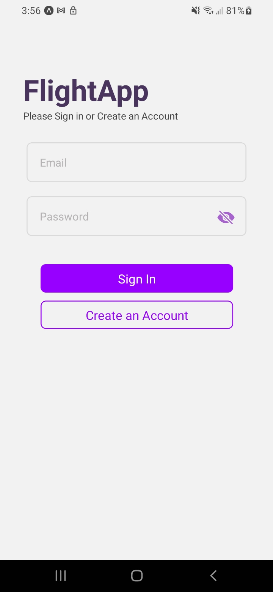
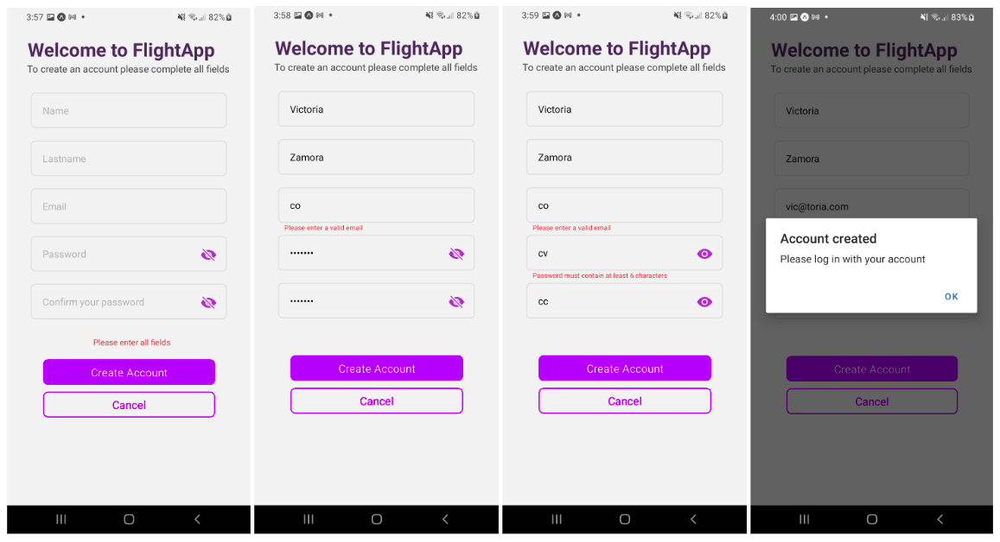
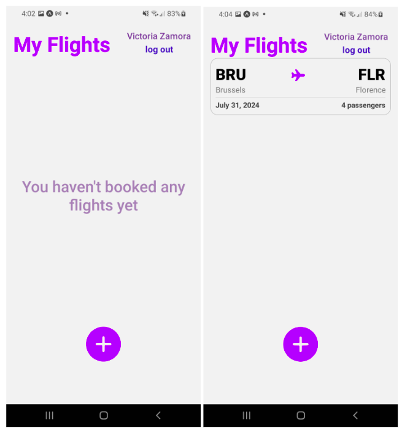
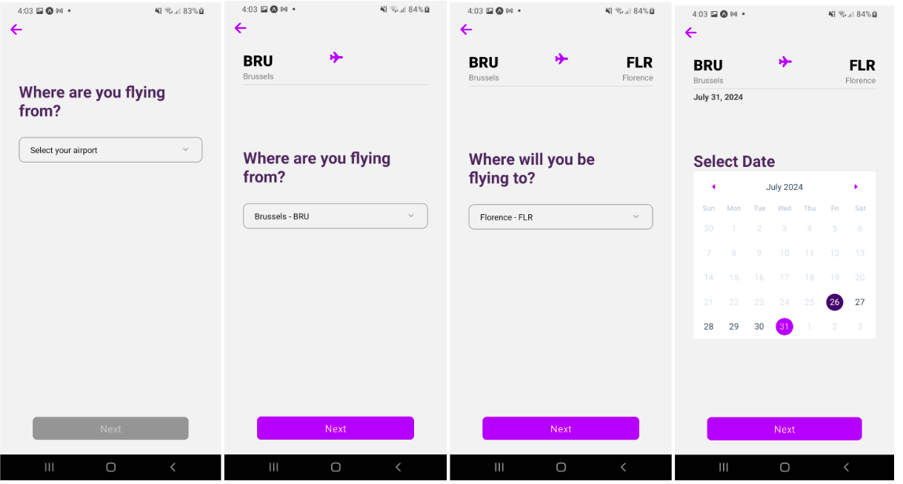
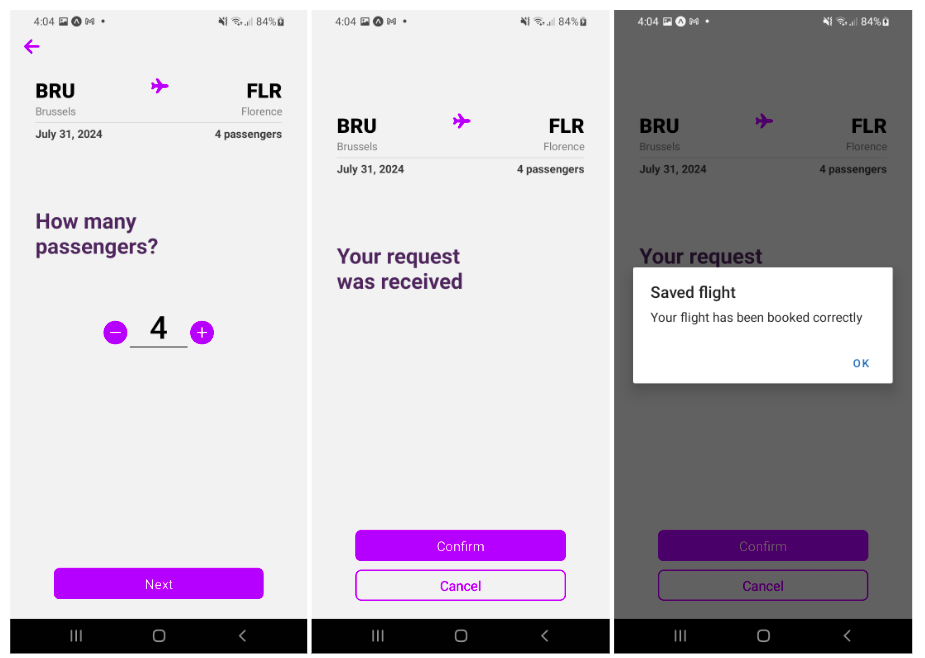
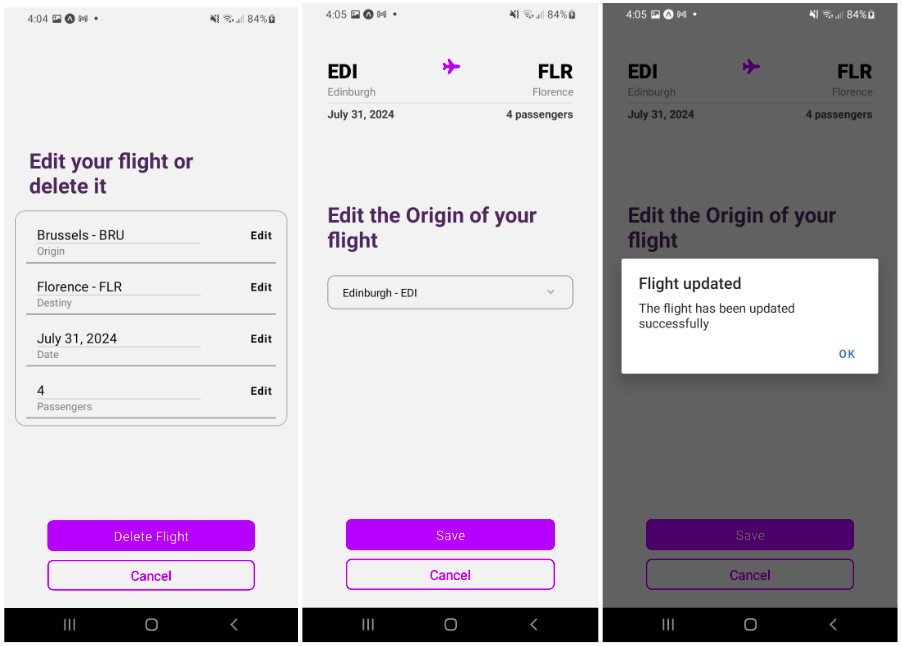
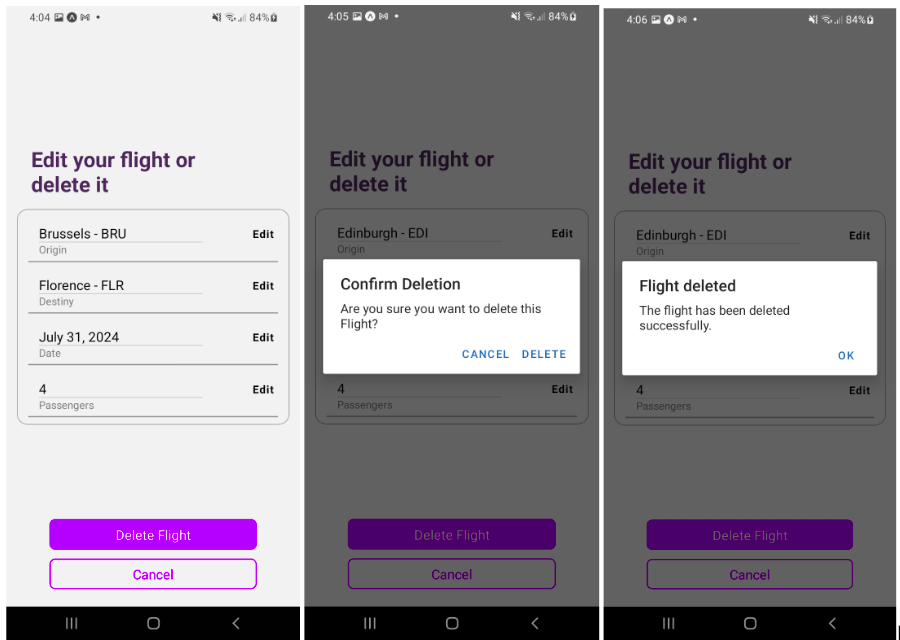

# Flight App
# Getting Started

A mobile application that allows creating flights by selecting the origin and destination from a local database, the date, and the number of passengers.

The flight is saved in a Firebase collection, and you can edit any data or delete the flight.

It also allows generating a user account and having your own list of flights according to the logged-in user.

## Authors

- [@Diana-Camz](https://www.github.com/octokatherine)


## Installation

You can clone this repository 
```bash
  git@github.com:Diana-Camz/FlightApp.git
```
and run the project with
```bash
  npx expo start
```
## Configure environment variables
Clone .env.template file to .env and add your environment variables

## Technologies used
- **React Native Expo**: For creating the mobile application.
- **Firebase**:
  - **Firestore**: For database.
  - **Authentication**: For user authentication.
- **React Navigation**: For navigation between screens.
- **Expo Constants**: For accessing application-specific constants.
- **dotenv**: For managing environment variables.

## Screenshots







